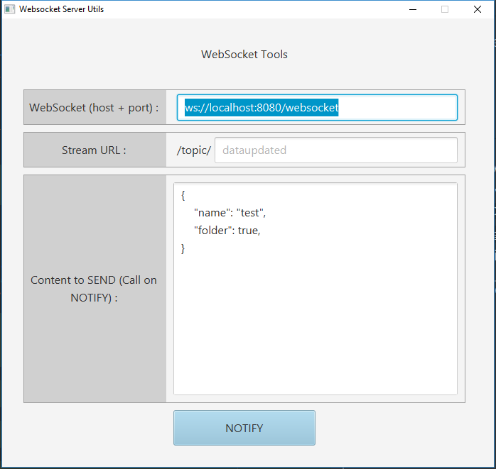

# WebSocket Server Utils

The purpose of this project is to provide a tools to test notification/messaging service using WebSockets ([Angular WebSocket client example](https://github.com/batiwo/spring-websocket-angular6)).

## Usage
1. Clone the repository `git clone https://github.com/batiwo/websocket-server-utils.git` 
2. Run the distributed JAR `distribution/websocket-server-utils-x.x.x-SNAPSHOT.jar` with `java -jar websocket-server-utils-x.x.x-SNAPSHOT.jar`
3. **OR** build the `spring-websocket` project with `mvn install`
4. Use a websocket client like [https://github.com/batiwo/spring-websocket-angular6](https://github.com/batiwo/spring-websocket-angular6).



## Configure
The endpoint and the streamUrl (`/topic` by default) are both configurable from `application.properties` or by JVM arguments (Using `-Dwebsocket.endpoint=/socket1` and `-Dwebsocket.handler=/topic1`).

## Build
The spring server is a basic spring-boot api with the `spring-websocket` dependency.

```xml
<dependency>
    <groupId>org.springframework.boot</groupId>
    <artifactId>spring-boot-starter-websocket</artifactId>
</dependency>
```

The WebSocketConfiguration is minimalist.
We just configure the MessageBroker with an Endpoint and setAllowedOrigins to anyone.
The Endpoint `/socket` means that you will connect to the [ws://server-url/socket](ws://server-url/socket) with your clients.

```java
@Configuration
@EnableWebSocketMessageBroker
@EnableScheduling
public class WebSocketConfiguration implements WebSocketMessageBrokerConfigurer {

    @Value("${websocket.endpoint}")
    private String _websocketEndpoint;

    @Value("${websocket.handler}")
    private String _stompHandler;

    @Override
    public void registerStompEndpoints(StompEndpointRegistry registry) {
        System.out.println("Using endpoint : " + _websocketEndpoint);
        registry.addEndpoint(_websocketEndpoint).setAllowedOrigins("*");
    }

    @Override
    public void configureMessageBroker(MessageBrokerRegistry registry) {
        registry.enableSimpleBroker(_stompHandler);
    }
}
```

## Contributor
[Sébastien DRUJONT](https://github.com/batiwo)
